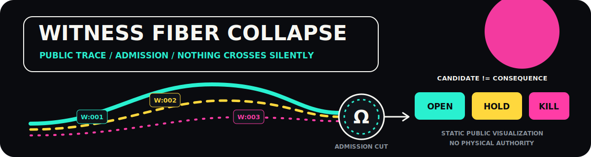

  

<h1 align="center">KY-ROX Public Demonstrators</h1>

  <strong>CANDIDATE != CONSEQUENCE</strong> 
  Bounded software demonstrations. Reproducible behavior. No physical authority.

> **STATUS: HOLD** — This tree is a bounded public-surface candidate. Repository-wide
> containment remains incomplete until historical references and external copies have
> been reviewed separately.

## The surface

This repository contains small, inspectable software demonstrations of one public
principle:

> A computed candidate does not become a consequence through momentum, confidence,
> age, or repetition.

Every released demonstrator must provide:

- a declared scope;
- explicit non-goals;
- pinned or deterministic inputs;
- one documented run path;
- an expected result;
- visible fail-closed behavior;
- no external actuation.

## PUNKT // BANE

| Mode | Public meaning |
|---|---|
| `PUNKT` | A frozen, reviewed, and versioned public reference |
| `BANE` | Exploratory work that is not hosted in this public repository |

This repository is a public `PUNKT` sink—not a `BANE` workspace.

A public branch is still public. Draft status does not create confidentiality.

## Public verdicts

A demonstrator may expose `OPEN`, `HOLD`, or `KILL` as bounded software outcomes.
These outcomes do not grant physical, operational, financial, or safety authority.

## Public microtests

- [Kernel Drift Observable v0.1](artifacts/microtests/kernel_drift_observable_v0_1/SURFACE.md)
  — deterministic synthetic measurement; measurement `OPEN`, research claim `HOLD`,
  physical and operational authority `NONE`.

## Reproduce a release

1. Read the artifact's `SURFACE.md`.
2. Run its documented test command.
3. Compare the result with `EXPECTED_OUTPUT.txt`.
4. Verify `CHECKSUMS.sha256`.
5. Treat any mismatch as `HOLD`.

## Public boundary

This repository may contain:

- sanitized demonstrator code;
- public test fixtures;
- expected outputs;
- release attestations;
- public-facing documentation and media.

It must never contain:

- protected architecture or control logic;
- operational thresholds or decision tables;
- production interlock or hardware mappings;
- internal audit-chain schemas or implementations;
- patent-sensitive mechanisms;
- private repository references;
- unreleased protocols, credentials, routes, or deployment parameters.

Material crossing this boundary does not merge here.

See [PUBLIC_BOUNDARY.md](PUBLIC_BOUNDARY.md), [STATUS_PUBLIC.md](STATUS_PUBLIC.md),
and [SECURITY.md](SECURITY.md).

## Scope

These artifacts are research and engineering demonstrations.

They are not safety-certified components, production controllers, physical
authorization systems, or validation of new physical claims.

---

<code>LOUD SURFACE / CLEAN CUT / NOTHING CROSSES SILENTLY</code>

