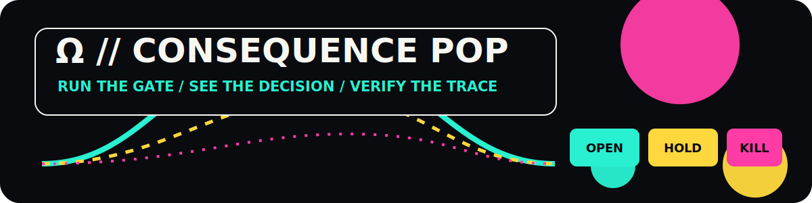

<p align="center">
  
</p>

<h1 align="center">KY-ROX Public Demonstrators</h1>

<p align="center">
  <strong>Ω // CONSEQUENCE POP</strong><br />
  Deterministic software surfaces for candidate/consequence separation, fail-closed gates, and witnessed evaluation.
</p>

<p align="center">
  
  
  
  
</p>

> **Prediction is not action.**

A generated candidate must never become a realized consequence merely because a model, controller, sensor, pipeline, or actuator can continue. Computational momentum does not equal physical authority.

## Run the surface

Each demonstrator carries its own local README, deterministic test command, expected verdicts, and scope boundary.

```text
1. CHOOSE A DEMO
2. READ ITS LOCAL BOUNDARY
3. RUN ITS RECORDED TEST COMMAND
4. COMPARE THE EXPECTED SEAL
5. TREAT OPEN AS BOUNDED SOFTWARE AUTHORIZATION ONLY
```

The goal is not spectacle without evidence. The visual surface is loud; the execution contract is strict.

## The structural invariant

> $$\text{Candidate} \neq \text{Consequence}$$

The resistance of the gate is invariant to the velocity, volume, or confidence of the generator. Admission requires explicit type progression and authorization; it cannot be achieved by omission, timeout, or computational continuation.

## Core architecture loop

Every evaluated transition follows:

$$x_{t+1}=\Omega(\Pi_K(\Phi(x_t)))$$

- **$\Phi$ — GENERATE:** explores noisy data, proposals, and possible trajectories.
- **$\Pi_K$ — PROJECT:** validates structure, type, boundaries, and invariants.
- **$\Omega$ — GATE:** returns the deterministic decision `OPEN`, `HOLD`, or `KILL`.
- **$W$ — WITNESS:** records the evaluated or committed event downstream.

```text
OPEN = passage to a bounded software result
HOLD = preserved candidate requiring re-admission
KILL = rejected candidate / no passage
```

`HOLD` is never delayed `OPEN`.

## PUNKT // BANE // GATE

| Plate | Demonstrator role |
|---|---|
| `P // PUNKT` | One visible bounded decision |
| `NP // BANE` | The candidate paths evaluated before the decision |
| `Πₖ // CUT` | Structure, integrity, and boundary projection |
| `Ω // CONSEQUENCE POP` | The explicit `OPEN/HOLD/KILL` surface |
| `W // RECORD` | Deterministic replay, manifest, trace, and run log |

`P` and `NP` are visual labels for **point** and **path-field**. They do not assert a result concerning the P versus NP complexity problem.

## Immutable type progression

```text
RAW
→ ESTIMATE
→ STRUCT
→ VIABILITY
→ SIM_AUTHORIZED
→ explicit COMMIT boundary
→ WITNESS
```

- **RAW:** event, operator input, telemetry, or proposal ingress.
- **ESTIMATE:** speculative generation and candidate trajectory.
- **STRUCT:** validated types, data structures, and integrity checks.
- **VIABILITY:** bounded evaluation against declared constraints.
- **SIM_AUTHORIZED:** permission for an explicit, bounded software result.
- **COMMITTED:** used only when a separately authorized irreversible transition actually occurs.
- **WITNESS:** downstream history of the evaluated or committed event.

Any shortcut across a required stage is a type violation and must fail closed.

```text
OPEN != COMMITTED
SIM_AUTHORIZED != PHYSICAL_ACTION
WITNESS != AUTHORITY
```

## Demonstrator scopes

This repository contains public reference layouts for:

- candidate/consequence separation;
- deterministic `OPEN/HOLD/KILL` gates;
- fail-closed input handling;
- bounded simulation results;
- hash-linked trace and witness principles;
- deterministic replay, manifests, and reproducible run logs;
- read-only terminal observability surfaces.

The public demonstrators do not expose protected interlock details, private thresholds, production witness internals, unpublished core algorithms, or deployment secrets.

## Intended research contexts

The architecture is relevant to systems where computation must not silently become external action, including:

- industrial and cyber-physical control research;
- robotics and autonomous-system simulation;
- critical-infrastructure governance models;
- AI-assisted action pipelines;
- developer tooling for typed authorization and audit.

## Claim and authority boundary

These artifacts are:

- deterministic software demonstrators;
- architectural and research instruments;
- local test surfaces.

They are not:

- safety-certified components;
- production interlocks;
- deployed hardware controllers;
- empirical validation of new physics;
- autonomous physical authority.

```text
FAIL_OPEN_EXPLORATION=ALLOWED
FAIL_CLOSED_CONSEQUENCE=REQUIRED
NO_COMMIT_BY_DEFAULT=TRUE
PHYSICAL_AUTHORITY=NONE
```

## Ecosystem

- **PUNKT // THEORY:** [`epistemic-architectures`](https://github.com/sololys/epistemic-architectures)
- **BANE // NOISE:** [`epistemic-architectures-notes`](https://github.com/sololys/epistemic-architectures-notes)
- **W // RECORD:** [Zenodo working paper](https://doi.org/10.5281/zenodo.18436983)

---

<p align="center"><code>LOUD SURFACE / STRICT GATE / ZERO SILENT COMMIT</code></p>
