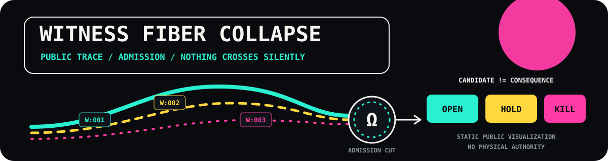

  

<h1 align="center">KY-ROX Public Demonstrators</h1>

  <strong>CANDIDATE != CONSEQUENCE</strong> 
  Bounded software demonstrations. Reproducible behavior. No physical authority.

> **STATUS: HOLD** — This tree is a bounded public-surface candidate. Repository-wide
> containment remains incomplete until historical references and external copies have
> been reviewed separately.

## 🏛️ Epistemic Foundation: Decoupling Capability from Authority

> *The architecture of the KY-ROX demonstrator is predicated upon a singular, uncompromising restriction: the generation of a computational candidate must never be mistaken for a realized consequence. Software possesses an inherent, dangerous tendency to assume that high predictive confidence and rapid execution inherently confer operational authority. To counter this, the framework establishes an absolute epistemic boundary, ensuring that a simulated outcome remains entirely isolated from physical execution. The demonstrator serves as a structural proof of this separation, operating as a deterministic engine where mathematical capability and operational authority are permanently decoupled.*
>
> *This restriction is not enacted as a flexible policy, but as an invariant mathematical law. By strictly enforcing the condition:*
>
> $$\boxed{\mathbf{\text{CANDIDATE\_GENERATION}} \neq \text{REALIZED\_CONSEQUENCE}}$$
>
> *the system ensures that no volume of computational repetition or simulated success can independently bridge the gap into physical reality. Within this architecture, the software is deliberately paralyzed by design. It evaluates states, resolves logical divergence, and identifies adversarial anomalies, yet it possesses zero authority to alter the physical world. It exists in a perpetual state of holding, demanding an external, causal admissibility test before any boundary can be crossed.*
>
> *The spatialization of this trust is formalized through the structural dichotomy of the public reference and the exploratory workspace. The public repository functions strictly as a frozen, immutable sink, an environment entirely stripped of proprietary volatility. It is not a laboratory for active generation, but a finalized ledger designed for third-party attestation. By confining all exposed software to this sterile domain, the architecture protects the volatile edge of private research while providing external auditors with a verifiable, zero-dependency artifact that proves the integrity of the underlying logic.*
>
> *When subjected to execution, the demonstrator reveals its fundamental fail-closed nature. It does not attempt to adapt to structural anomalies or sustain operation through corrupted states. Instead, it moves deterministically through a sequence of divergence checks and baseline reconciliations, culminating in a definitive binary outcome. If an adversarial fork or an irreconcilable state is detected, the framework does not seek repair; it invokes an immediate, unyielding termination. Safety, within this paradigm, is not defined by the ability to maintain continuous operation in the face of uncertainty, but by the absolute, instantaneous capacity to shut the system down.*

---

## ⚡ The Public Surface & Invariants

Every released demonstrator must provide:

- a declared scope;
- explicit non-goals;
- pinned or deterministic inputs;
- one documented run path;
- an expected result;
- visible fail-closed behavior;
- no external actuation.

## PUNKT // BANE

| Mode | Public meaning |
|---|---|
| `PUNKT` | A frozen, reviewed, and versioned public reference |
| `BANE` | Exploratory work that is not hosted in this public repository |

This repository is a public `PUNKT` sink—not a `BANE` workspace.

A public branch is still public. Draft status does not create confidentiality.

## Public verdicts

A demonstrator may expose `OPEN`, `HOLD`, or `KILL` as bounded software outcomes.
These outcomes do not grant physical, operational, financial, safety, or production
authority.

The canonical public claim contract is
[punkt/contracts/claim-levels.md](punkt/contracts/claim-levels.md). The current
repository state is recorded in [STATUS_PUBLIC.md](STATUS_PUBLIC.md).

## Public microtests

- [Kernel Drift Observable v0.1](artifacts/microtests/kernel_drift_observable_v0_1/SURFACE.md)
  — deterministic synthetic measurement; measurement `OPEN`, research claim `HOLD`,
  physical and operational authority `NONE`.

## Reproduce a release

1. Read the artifact's `SURFACE.md`.
2. Run its documented test command.
3. Compare the result with `EXPECTED_OUTPUT.txt`.
4. Verify `CHECKSUMS.sha256`.
5. Treat any mismatch as `HOLD`.

## Public boundary

This repository may contain:

- sanitized demonstrator code;
- public test fixtures;
- expected outputs;
- release attestations;
- public-facing documentation and media.

It must never contain:

- protected architecture or control logic;
- operational thresholds or decision tables;
- production interlock or hardware mappings;
- internal audit-chain schemas or implementations;
- patent-sensitive mechanisms;
- private repository references;
- unreleased protocols, credentials, routes, or deployment parameters.

Material crossing this boundary does not merge here.

See [PUBLIC_BOUNDARY.md](PUBLIC_BOUNDARY.md), [STATUS_PUBLIC.md](STATUS_PUBLIC.md),
[punkt/contracts/claim-levels.md](punkt/contracts/claim-levels.md), and
[SECURITY.md](SECURITY.md).

## Scope

These artifacts are research and engineering demonstrations.

They are not safety-certified components, production controllers, physical
authorization systems, or validation of new physical claims.

---

<code>LOUD SURFACE / CLEAN CUT / NOTHING CROSSES SILENTLY</code>

