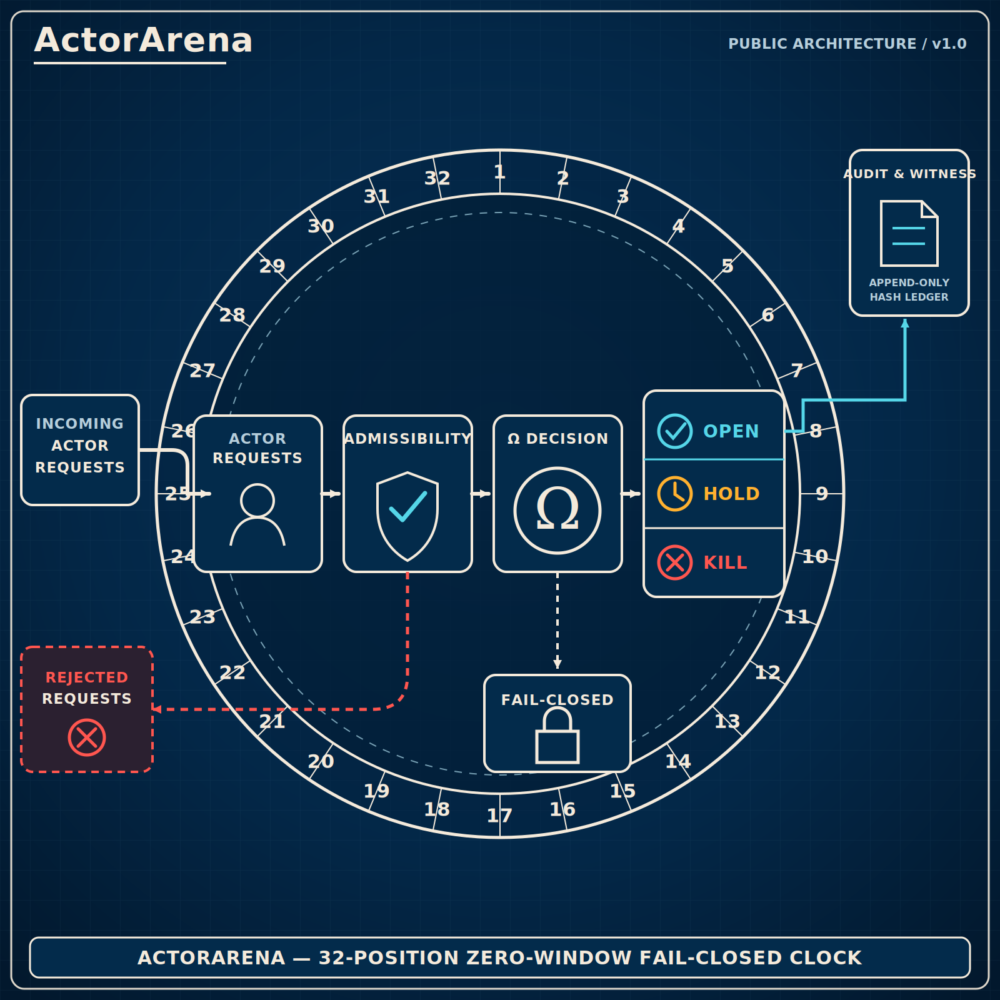

# ActorArena 32 Clock v0.1



`ActorArena` is a bounded public software demonstrator for a 32-position,
zero-window, fail-closed request clock.

## Visible route

```text
incoming request
      |
      v
actor position -> admissibility -> Omega -> OPEN -> state + append-only witness
                       |             |----> HOLD -> unchanged state
                       |             `----> KILL -> unchanged state
                       `------------------> REJECTED (terminal)
```

The public rule is deliberately small:

- only the actor at the active clock position enters the decision stage;
- malformed, out-of-range, and wrong-window requests terminate as `REJECTED`;
- `KILL` dominates `HOLD` when integrity and readiness both fail;
- only `OPEN` changes demonstrated state;
- only realized `OPEN` events enter this demonstrator's append-only hash chain;
- all non-`OPEN` outcomes remain fail-closed.

## Run

```bash
python3 actorarena.py
python3 -m unittest -v
sha256sum -c CHECKSUMS.sha256
```

Compare the first command with `EXPECTED_OUTPUT.txt`.

## Status

`DETERMINISTIC SOFTWARE DEMONSTRATOR / PUBLIC SURFACE / NO EXTERNAL ACTUATION`

This artifact is not a production controller, safety component, physical authority,
financial gate, authentication system, or disclosure of protected runtime logic.
See `SURFACE.md` for the explicit boundary.
